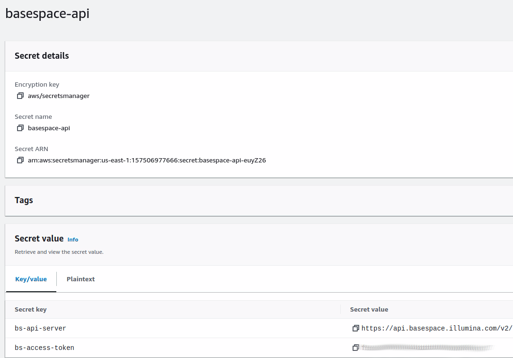

### Build docker image

From the root directory, build the docker image
```bash
docker build . -t ota
```

### Push docker image to ECR

Replace `ACCOUNT_ID` and `REGION`
```bash
 docker push <ACCOUNT_ID>.dkr.ecr.<REGION>.amazonaws.com/ota:latest
```

### Create secret for API
This stack requires that you store a secret in AWS Secret Manager that contains the BaseSpace API server URL as well
as the API Access Token.

The secret should be named `basespace-api` and contain two key/value pairs:

- `bs-api-server` - The URL of the BaseSpace API server. 
- `bs-access-token` - The access token for the BaseSpace API




### Create Stack 

Go to the CloudFormation console and create the stack.
- Select `Create Stack` and `With new resources (standard)`
- Select `Upload template file` and click `Choose file`
- Upload the `aws/automation_stack.yaml` file and click `Next`
- Enter a stack name, add the ARN for the secret created above, 
  select a subnet, and add your email to the `NotificationEmail` parameter
- Click `Next` twice the scroll to the bottom and check the box that says 
`I acknowledge that AWS CloudFormation might create IAM resources with custom names.`
- Click `Submit`

The stack will take a few minutes to complete the creation of all the resources. You can track the status in 
the `Events` tab when you click on the stack in the CloudFormation console UI.

### Confirm SNS subscription

When the stack is created it will automatically email the `NotificationEmail` set
at stack creation time. This email will ask you to verify your subscription to the topic. Once
verified your email will receive status notifications from the stack.
